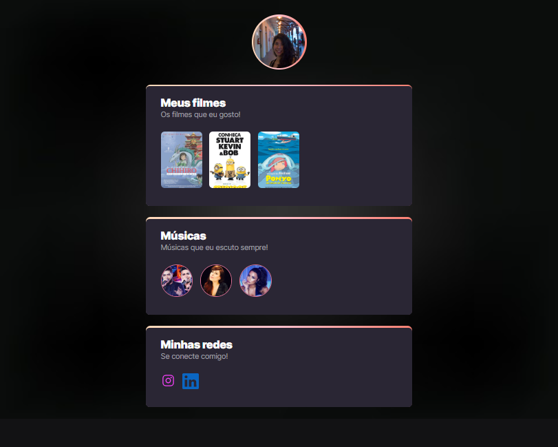

# NLW eSports

>Trilha explorer

Projeto construido no evento Next Level Week da reocketseat

[clique para acessar](https://amandaaiko03.github.io/first-code/)

##Tecnologias 

-HTML
-CSS
-Git e github

# O que eu aprendi

>1°A paciência é a principal chave da programação, pois sem ela não há programa rodando.

>2° A persistência é a qualidade que todo programador deve ter, para não desistir no meio do caminho!

>3° A me divertir enquanto estou desenvolvendo os códigos.

>4° Faça pausas.

## Contato

amandaaiko3@hotmail.com

